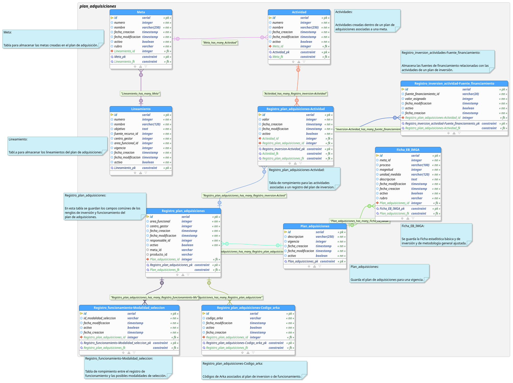

# PLAN ADQUISICIONES CRUD

Api CRUD para negocio de plan de adquisiciones del sistema de gestion financiera kronos. El proyecto está escrito en el lenguaje Go, generado mediante el **[framework beego](https://beego.me/)**

## Modelo de datos


# Instalación y Ejecución

Para instalar y correr el proyecto de debe relizar lo siguientes pasos:

## Opción 1: Docker

**para usar esta opcion es necesario contar con [DOCKER](https://docs.docker.com/) y [DOCKER-COMPOSE](https://docs.docker.com/compose/) en cualquier SO compatible**

- Clonar el proyecto de github y ubicarse en la carpeta del proyecto:
```shell
git clone https://github.com/udistrital/plan_adquisiciones_crud.git
cd plan_adquisiciones_crud
```

- Correr el proyecto por docker compose 
1. Crear red de contenedores denominada back_end con el comando:

```sh
docker network create back_end
```


2. Para construir y correr los contenedores:

```sh
docker-compose up --build
```
- Al finalizar se podran consumir los servicios del API en los puertos definidos en **.env** y **custom.env** actualmente 8080
# Licencia
[licencia](LICENSE)


